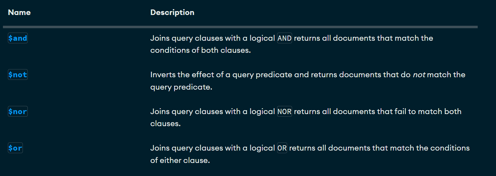

# CRUD Y CONSULTAS EN Mongodb

### Crear una base de datos
Solo se crea si contiene por lo menos una coneccion
``` json
use bd1
```

### Como utilizar show
Para conocer todas las bases de datos 
del servidor de MongoDB utilizamos el comando:
``` json
show dbs
```

### Como utilizar "use" para utilizar una coleccion "db1"
Mediante el comando use activamos la 
base de datos que queremos trabajar:
``` json
test> use bdejemplo
switched to db bdejemplo
bdejemplo>
```

## Como utilizar "show collections"
Mostrar colecciones en la base de datos actual
``` json
> show collections
coleccion1
coleccion2
```
## Como crear una coleccion
para crear una nueva colección.
``` json
db.createCollection("nombre_de_coleccion")
```

#### Borrar coleccion 
``` json
db.dropDatabase()
```

#### Mostrar las colecciones de esa bd 
``` json
show collections
```

## Insertar un solo documento en una colección
El método **insertOne()** en MongoDB se utiliza para 
insertar un solo documento en una colección, 
asignando automáticamente un único _id si no se 
proporciona, y admitiendo preocupaciones de escritura 
y transacciones de varios documentos.

``` json
db.alumnos.insertOne( { 
    nombre: 'Soyla',
    apellido1: 'Vaca',
    edad: 32,
    ciudad: 'San Miguel de las piedras'
}
)
```

## Inserccion de un documento mas complejo con arrays

```json
bdejemplo> db.alumnos.insertOne(
{
    nombre: "Joaquin",
    apellido1: "Dorian",
    apellido2: "Guerrero",
    edad: 15,
        aficiones:[
            'Cerveza', 'Hueva', 'Canabis'
        ]
    }
)
```

#### Select * from alumnos
``` json
db.alumnos.find({})
```

## Insersion de documentos mas complejos con documentos anidados y ID

```json
db.alumnos.insertOne(
{
    nombre: "Jose Luis",
    apellido1: "Herrera",
    apellido2: "Gallardo",
    edad: 41,
    estudios: [
            'Ing en Sistemas Computacionales', 
            'Maestria en Tecnologias de la Informacion'
        ],
    experiencia: {
        lenguaje: "SQL",
        sbd: "SQL Server",
        aniosExperiencia: 14
        }
    }
)


db.alumnos.insertOne({
    _id: 3,
    nombre:"Sergio",
    apellido:"Ramos",
    equipo: "Gallardios",
    aficiones: ["dinero","hombres","Fiesta"]
    talentos: {
        futbol: true, 
        bañarse: false
    }
}
)

```

#### Consulta de igualdad
``` json
db.alumnos.find( { _id: 5 } )
```

## Insertar multiples documentos

```json
db.alumnos.insertMany({
    [
        {
            _id: 12,
            nombre: 'Roberto',
            apellido: 'Gomez',
            edad: "23",
            descripcion: "Es un comediante bueno"

        },
        {
            nombre: 'Luis',
            apellido: "Suarez",
            edad: 43,
            habilidades : [
                'Correr', 'Dormir', 'Morder'
            ],
            direcciones: {
                calle: 'Del infierno',
                numero : 666
            },
            esposas:[
                {
                    nombre: 'Maria', 
                    edad: 20,
                    pension: 350,
                    hijos: ['Joaquin', 'Bridget']
                    },
                    {
                        nombre: "Dorian",
                        edad: "46",
                        pension: 4500.56,
                        complaciente: true
                    }
            ]
        }
    ]
}
)
```

# Practica 1 de --libros--
### Cargar Datos
[Libros.json](./data/libros.json)

## Busquedas. Condiciones simples de igualdad. Metodo find()
1. Seleccionar todos los documentos de la coleccion Libros
``` json
db.libros.find({})
```

2. Mostrar todos los docuemntos que sean de la editorial biblio
``` json
db.libros.find({editorial:'Biblio'})
```

3. Mostrar todos los docuemntos que el precio sea 25
``` json
db.libros.find({precio: 25})
```

4. Seleccionar todos los documentos donde el titulo sea json para todos
``` json
db.libros.find({titulo: 'JSON para todos' })
```

# Operadores de comparacion

[Operadores de comparacion](https://www.mongodb.com/docs/manual/reference/operator/query/)


1. Mostrar todos los documentos donde el precio sea mayor a 25
``` json
db.libros.find({precio: {$gt:25}})
```

2. Mostrar los documentos donde el precio sea 25
``` json
db.libros.find({precio: {$eq:25}})
```

3. Mostrar los documentos cuya cantidad sea menor a 5
``` json
db.libros.find({cantidad: {$lt:5}})
```

4. Mostrar los documentos que pertenezcan a la editorial biblio o planeta
``` json
db.libros.find({editorial: {$in:['biblio', 'planeta']}})
```

5. Mostrar todos los documentos de libros que cuesten 20 o 25
``` json
db.libros.find({precio: {$in:[20, 25]}})
```

6. Mostrar todos los documentos de libros que no cuesten 20 o 25
``` json
db.libros.find({precio: {$nin:[20, 25]}})
```

7. Mostrar el primer docomento de libros que cueste 20 o 25
``` json
db.libros.findOne( { precio: { $in: [20, 25] } } )
```
## Operadores Logicos

[Operadores Lógicos](https://www.mongodb.com/docs/manual/reference/operator/query/)



### Operador AND
Dos posibles opciones de AND

1. La simple, mediante condiciones separadas por comas ***sintaxis***
``` json
db.coleccion.find({ 
    condiciones1, condiciones2 
    }) // Con esto asume que es una ***and***
```

2. Usando el operador $and
***sintaxis***
``` json
db.coleccion.find({ $and:[{condiciones1},{condiciones2}] })
```


#### Ejercicios

1. Mostrar todos aquellos libros que cuesten mas de 25 y cuya cantidad sea inferior a 15

***Forma Simple***
``` json
db.libros.find({ 
precio: {$gt:25},
cantidad: {$lt:15}
})
```

``` json
db.libros.find({ 
    $and:[{precio: {$gt:25}},
    {cantidad: {$lt:15}}] 
    })
```

2. Mostrar todos aquellos libros que cuesten mas de 25 y cuya cantidad sea inferior a 15 y id igual 4
``` json
db.libros.find({
    precio: {$gt:25},
    cantidad: {$lt:15},
    _id:4
    })
```

``` json
db.libros.find({
    precio: { $gt: 25 } , 
    cantidad: { $lt: 15 }, 
    _id:{$eq:4}
})
```

***Operador $and***

 1. Mostrar todos aquellos libros que cuesten mas de 25 y cuya cantidad sea inferior a 15
``` json
db.libros.find(
    {  
      $and:[
        {precio:{$gt:25}},
        {cantidad:{$lt:15}}
      ]
    }
 )
```

 2. Mostrar todos aquellos libros que cuesten mas de 25 y cuya cantidad sea inferior a 15 y id igual 4
``` json
db.libros.find(
    {  
      $and:[
        {precio:{$gt:25}},
        {cantidad:{$lt:15}},
        {_id:4}
      ]
    }
 )
```
-------------------------------------------------------------------------------------------------------------------

 ### Operador OR

 #### Mostrar todos aquellos libros que cuesten mas de 25 o cuya cantidad sea inferior a 15 

```json
 db.libros.find( { $or: [{ precio: { $gt: 25 } }, { cantidad: { $lt: 15 } }] })
 ```

 ### AND y OR Combinadas 

1. Mostrar los libros de la editorial Biblio con precio mayor a 40 o libros de la editorial Planeta con precio mayor a 30
``` json
db.libros.find(
    {
      $or: [
           { $and:[{editorial:'Biblio'},{precio:{$gt:30}}]},
           { $and:[{editorial:{$eq:'Planeta'}},{precio:{$gt:20}}]}
      ]
    }
)
```


``` json
db.libros.find(
    {
      $or: [
           {editorial:'Biblio',precio:{$gt:30}},
           { editorial:{$eq:'Planeta'},precio:{$gt:20}}
      ]
    }
)
```


## Proyección de Columnas

*** Sintaxis ***
``` json
db.coleccion.find(filtro, columnas)
```

``` json
db.libros.find({},{titulo:1})
```

1. Seleccionar todos los documentos, mostrando el titulo y 
   la editorial

```json
    db.libros.find({},{titulo:1, editorial:1})
    db.libros.find({},{titulo:1, editorial:1, _id:0})
```

2. Seleccionar todos los documentos de la editorial planeta, mostrando solamente el titulo y la editorial

```json
   db.libros.find(
   {editorial:'Planeta'}, 
   {_id:0, titulo:1, editorial:1}
   )
```

## Operador exists (Permite saber si un campo se encuentra o no en un documento)
```json
db.libros.find({ editorial:{$exists:true}})

db.libros.insertOne(
  {
    _id:10,
    titulo: 'Mongo en entornos gráficos',
    editorial: 'Terra', 
    precio:125
  }
)
```
1. Mostrar todos los documentos que no contengan el campo cantidad

```json
db.libros.find( { cantidad: { $exists: true }})
```

## Operador Type (Permite preguntar si un determinado campo corresponde con un tipo)

[Operador Type](https://www.mongodb.com/docs/manual/reference/operator/query/type/#mongodb-query-op.-type)

1. Mostrar todos los documentos donde el precio sean dobles
``` json
db.libros.find({precio:{$type:1}})
//-----------------------------------------------------------------
db.libros.find({precio:{$type:16}})
//-----------------------------------------------------------------
db.libros.insertOne({
  _id:11,
  titulo:'IA',
  editorial: 'Terra',
  precio:125.4,
  cantidad:20
})
//-----------------------------------------------------------------
 db.libros.find({precio:{$type:1}}, {_id:0})
//-----------------------------------------------------------------
 db.libros.find({precio:{$type:1}}, {_id:0, cantidad:0})
//-----------------------------------------------------------------
  db.libros.insertMany([
 {
    _id: 12,
    titulo: 'IA',
    editorial: 'Terra',
    precio: 125, 
	cantidad: 20
  },
  {
    _id: 13,
    titulo: 'Python para todos',
    editorial: 2001,
    precio: 200, 
	cantidad: 30
  }]
  )
```

1. Seleccionar los documentos donde la ediatorial sea de tipo entero
  db.libros.find({editorial:{$type:16}})
  db.libros.find({editorial:{$type:'int'}})

2. Seleccionar todos los documentos  donde la editorial sea string
db.libros.find({editorial:{$type:'string'}})
db.libros.find({editorial:{$type:2}})

## Practica de Consultas
1. Instalar las tools de mongodb
[DatabaseTools](https://www.mongodb.com/try/download/database-tools)

2. Cargar el json empleados (Debemos estar ubicados en la carpeta donde se encuentra el JSON empleados)

- En local:
  comando:
    mongoimport --db curso --collection empleados --file empleados.json
- Docker:
    mongoimport --db curso --collection empleados --file empleados.json --port 27018

# Modificando Documentos
## Comandos importantes

1. updateOne -> Modificar un solo documento
2. updateMany -> Modificar multiples documentos
3. replaceOne -> Sustituir el contenido completo de un documento

Tiene el siguiente formato:

``` json
db.collection.updateOne(
  {filtro},
  {operador: }
)
```

[Operadores Update](https://www.mongodb.com/docs/manual/reference/operator/update/)
--------------------------------------------------------------------------

### Operador set
1. Modifcar un documento
``` json
db.libros.updateOne({
    {titulo: "Python para todos"}, {$set: {autor: "Juan"}}
    })
```

2. Actualizar el precio a 100 y la cantidad a 50 para el _id: 10

``` json
db.libros.updateOne({_id: 10},{$set:{precio: 100, cantidad: 50}})
```

#### Modificar multiples documentos
-- Modificar todos los documentos donde el precio sea mayor a 100, a un precio de 150
``` json
db.libros.updateMany(
{precio: {$gt:100}},
{$set: {precio: 150}}
)

// Para corroborar
db.libros.find(
{
    precio:{$gt:150}
}
)
```

2. Operador $inc y $mull

- Actualizar con un incremento de cinco todos los documentos
``` json
db.libros.updateMany({},
    {$inc: {precio: 5}}
)
```

- Actualizar con multiplicacion de 2 todos los docuemntos que la cantidad sean mayores a 20
``` json
db.libros.updateMany(
{cantidad: {$gt: 20} },
{$mul: {cantidad: 2}}
)
```
- Actualizar todos los documentos donde el precio sea mayor a 20 y se multiplique por 2 la cantidad y el precio

``` json
db.libros.updateMany(
{precio:{$gt:20}},
{$mul:{cantidad:2, precio:2}}
)

//-----------------------------------------------
db.libros.find({_id:2})
```

3. reemplazar documentos (replaceOne) cambia todo
``` json
db.libros.find({_id:2})

db.libros.replaceOne(
{_id:2},
{titulo: "De la tierra a la luna", autor: "Jules Verne", precio: 500
})
```

# Borrar documentos
1. deleteOne -> elimina un solo documento
2. deleteMany -> elimina multiples documentos

1. Eliminar el documento con id 2
``` json
db.libros.deleteOne({_id:2})
```

2. Eliminar los documetos donde la cantidad sea mayor o igual a 100 
``` json
//db.libros.deleteOne({$gt:{cantidad: }})
db.libros.deleteMany({cantidad:{$gte:100}})
```

# Expresiones regulares
1. Buscar los libros que contengan el titulo de la letra t
``` json
db.libros.find({titulo:/t/})
```

2. Busca los libros que en el titulo cotengan la palabra json
``` json
db.libros.find({titulo:/JSON/})
```

3. Buscar todos los documentos que en el titulo terminen en tos
``` json
db.libros.find({titulo:/tos$/})
```

4. Buscar los documentos que en el titulo comience con J
``` json
db.libros.find({titulo:/^J/})
```

# Operador $regex
[Operador Regex](https://www.mongodb.com/docs/manual/reference/operator/query/regex/)

- Seleccionar los libros que contengan la palabra para en titulo
``` json
db.libros.find({titulo: {$regex: 'para'}})
//--------------------------------------------------------
db.libros.find({titulo:{$regex:'JSON'}})
//--------------------------------------------------------
db.libros.find({titulo:{$regex:/JSON/}})
```

- Distinguir entre mayusculas y minusculas
``` json
db.libros.find({titulo:{$regex:/json/}}) // No distingue entre mayusculas y minusculas

db.libros.find({titulo:{$regex:/json/i}})

db.getCollection('libros').find({
  titulo: {
    $regex: RegExp('json'),
    $options: 'i'
  }
});
```

-- Seleccionar todos los libros que comiencen con j o J
``` json
db.getCollection('libros').find({
  titulo: { $regex: RegExp('^j', 'i') }
});
```

--Seleccionar todos los libros que terminen es
``` json
db.libros.find({titulo:{$regex: /es$/i}})
///---------------------------------------------
db.libros.find({titulo:{$regex: 'es$', $options:'i'}})
```

# Metodo sort (Ordenar Documentos)

1. Ordenar los libros de manera acendente por el precio
``` json
db.libros.find({},{titulo:1, precio:1, _id:0}).sort({precio:1})
```

2. Ordenar los libros de manera descendente por el precio
``` json
db.libros.find({},{titulo:1, precio:1, _id:0}).sort({precio:-1})
```

3. Ordenar los libros de manera asencente por la editorial y de manera descendente por el precio, mostrando el titulo, el precio y la editorial
``` json
db.libros.find({}, {titulo:1, precio:1, editorial:1, _id:0}).sort({editorial:1, precio:-1})
```

# Otros Métodos skip, limit, size
``` json
db.libros.find({}).size()

//-----------------------------------------------------------
db.libros.find({titulo:{$regex:/Java/i}}).size()
```

-- Buscar todos los libros pero mostrando los dos primeros
``` json
db.libros.find({},{titulo:1, editorial:1, precio:1, _id:0}).limit(2)
```

-- Mostrar los 3 ultimos libros
``` json
db.libros.find({},{titulo:1,editorial:1, precio:1, _id:0}).sort({precio:-1}).limit(3)

db.getCollection('libros')
  .find({}, { titulo: 1, editorial: 1, _id: 0 })
  .sort({ titulo: 1, precio: -1 })
  .limit(4);
```
  # Borrar Colecciones y base de Datos

  use db5
  db.createCollection('ejemplo')
  show collections

  db.ejemplo.insertOne({nombre: 'Chapuin'})
  db.ejemplo.drop()
  db.dropDatabase()

# Agregaciones en MongoDB
## Que son las agregaciones en MongoDB
## Funcionamiento
## Sintaxis
## Ejemplos
